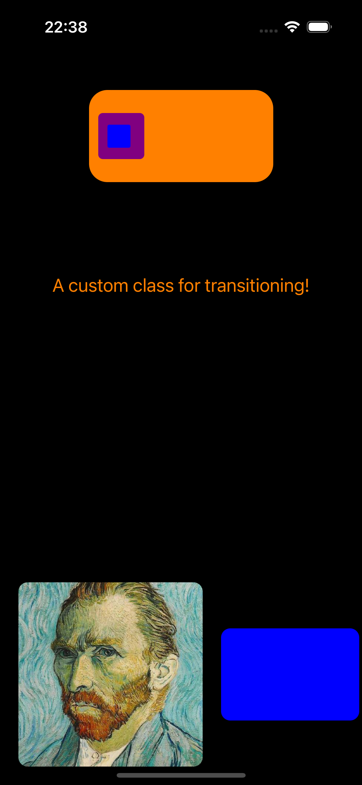

# A class for custom static transitioning

Achieving nice and smooth animation when navigating between view controllers in UIKit involves quite a lot of boiler plate code that one needs to implement for each transition in an App. This implementation aims at removing the burden of writing all that boring pieces of code ( submitting to delegate methods, implement protocol stubs ecc...), without losing the flexibility that the transition context give us as developers. Below you can find an example of how the class works. 

## Known issues:

- Morphing complex views: views that have subviews will show wrong morphing animation. We can implement an algorithm that checks if the added morphing views have subviews, and handle this case accordingly. The visual issue will most likely happen when the view that we’re animating need to change their dimension (getting it bigger will cause the most trouble probably). The reason is that we’re taking snapshots of these view and increasing the dimension of this snapshot will cause the image to be strechted
- UILabel show some issues, since we take snapshots of it. Similarly to UIImageView, it needs proper handling: we probably have to add a specific method for them
- the match methods won’t probably work for views that are subviews of more complex view. In particular, the frame that of these views needs to be converted into the global coordinate system. Think of a cell in a collection view: the frame property returns a frame in the collection view coordinate system

## A working example

Below you can find a example of the StaticTransition class used for a simple App. 
The app is composed of two view controllers, the first view controller looks like this:


## Navigation controller case : push or pop

When navigating using navigation controllers, initialize the transition class and match the geometries that you want to animate. After that, simply call push. An example: 

```swift
let toVC = ToViewController()
let transitionClass = StaticTransition(duration: 0.5, isModal: false, fromViewController: self)
transitionClass.matchGeometryUIImageViews(fromImageView: self.profilePic, toImageView: toVC.smallerProfilePic)
transitionClass.matchSimpleUIViewGeometry(fromView: self.bottomBar, toView: self.topBar)
navigationController?.pushViewController(toVC, animated: true)
```

When the class gets initialized, it’ll handle everythin for you, no more boiler plate code!

When popping  a view controller, you will need a reference to the view controller you’re returning to. You can either keep a weak reference to that view controller in the current view controller, or:

```swift
  guard let toVC = navigationController?.viewControllers[ (navigationController?.viewControllers.count ?? 0) - 2] as? FromViewController else {
      print("smt went wrong ")
      return
  }
  let transitionClass = StaticTransition(duration: 0.5, isModal: false , fromViewController: self)
  
  transitionClass.matchGeometryUIImageViews(fromImageView: self.smallerProfilePic, toImageView: toVC.profilePic)
  transitionClass.matchSimpleUIViewGeometry(fromView: self.topBar, toView: toVC.bottomBar)
  navigationController?.popViewController(animated: true)
```

## Modal presentation case: present or dismiss

When navigating using modal presentation, you will need to assign the transitioning delegate to the presented view controller. Moreover, you need to keep a weak reference of the presenting view controller in the presenting view controller ( this is needed when dismissing the presented view controller)

```swift
let toVC = ToViewController()
toVC.presentingVC = self
let transitionClass = StaticTransition(duration: 0.5, isModal: true, fromViewController: self)
toVC.modalPresentationStyle = .fullScreen
toVC.transitioningDelegate = transitionClass
transitionClass.matchGeometryUIImageViews(fromImageView: self.littleImageView, toImageView: toVC.littleImageView)
transitionClass.matchSimpleUIViewGeometry(fromView: smallRectangle, toView: toVC.smallRectangle)
self.present(toVC, animated: true)
```

When dismissing, remember to assign the transitioning delegate:
